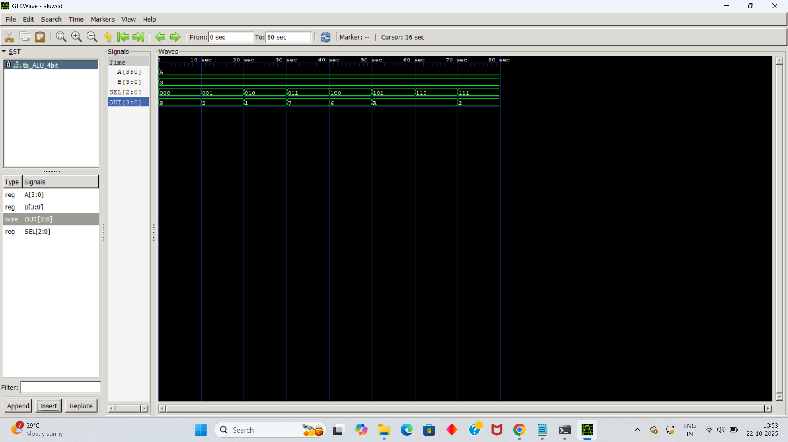

# 4-bit-ALU-verilog
verilog, vlsi, alu,ics
# 🧮 4-bit ALU (Arithmetic Logic Unit) in Verilog

### 👩‍💻 Created by: Shabnam Ara
### 🎓 Jamia Millia Islamia — B.Tech (Electronics and VLSI)

---

## 🧠 Project Overview

This project implements a *4-bit Arithmetic Logic Unit (ALU)* using Verilog HDL.  
The ALU performs basic arithmetic and logic operations like addition, subtraction, AND, OR, XOR, NOT, and bit shifts.

---

## ⚙ Features

| Operation | SEL Code | Description |
|------------|-----------|--------------|
| A + B      | 000       | Addition     |
| A - B      | 001       | Subtraction  |
| A & B      | 010       | Bitwise AND  |
| A \| B     | 011       | Bitwise OR   |
| A ^ B      | 100       | Bitwise XOR  |
| ~A         | 101       | Bitwise NOT  |
| A << 1     | 110       | Shift Left   |
| A >> 1     | 111       | Shift Right  |

---

## 🧪 Simulation

You can test this project using:
- [EDA Playground](https://edaplayground.com/)
- ModelSim or Vivado

*Steps:*
1. Copy both Verilog files (ALU_4bit.v and tb_ALU_4bit.v).
2. Paste in EDA Playground (select Verilog + Icarus Verilog).
3. Run simulation and observe the results in console/waveform.

---

## 📊 Expected Output Example
This waveform shows the correct output (OUT) for various operations selected by the SEL code, confirming the ALU's funtionality.
